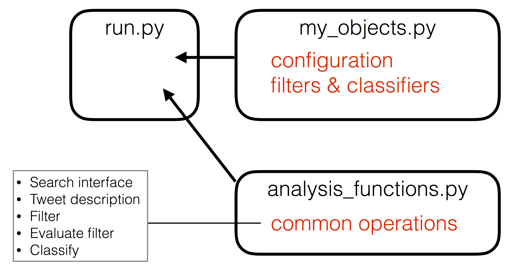

# Purpose

This sample code demonstrates the processes and tools
described in the Filter Optimization paper (link TBD).

# Code Elements

To access Tweet data from the Twitter Search API, you must have a file
called `.creds.yaml` in your local directory with the following structure:

```yaml

username: MY_USER_NAME
password: MY_PASSWORD
search_endpoint: "https://data-api.twitter.com/search/..."
```

## Top-level Control

This repository contains simple examples of collecting data from the Twitter
Search API, and filtering and classifying those Tweets. At each step in the
process, the user can choose to describe the Tweets, in which descriptive
statistics are calculated for the Tweets and associated users.  The user can
also choose to calculate performance metrics at each step, which involves hand
labeling a subset of the Tweets.  A large set of possible operations is defined
in `run.py`. This executable script is meant to define the overall flow of
operations.  The script imports the core set of functions (description,
filtering, labeling, and classification). The script imports configuration data
for the operations, including custom implementations of filters and
classifiers. 

Nearly all operations are optional. For example, if you don't have access to
the Search API, you can simply read in Tweet data that you have on disk.  If
classification is not relevant, the workflow can be limited to filters,
evaluations, and metric calculations.



## Custom Objects

The module `my_objects` contains a variety of custom configuration
dictionaries, all of which are packaged into a main `config` dictionary.  It
also defines trivial and not-so-trivial filters and classifiers, These examples
demonstrate the expected form for these objects. 

## Analysis Functions

The module `analysis_functions` contains the primary function definitions.
These functions are highly configurable via arguments and shouldn't need
modification for simple workflow setup. Functions in this module use the `lblr`
module for hand-labeling, and the `metrics_lib` module for definitions of
corpus-quality metrics.

 
